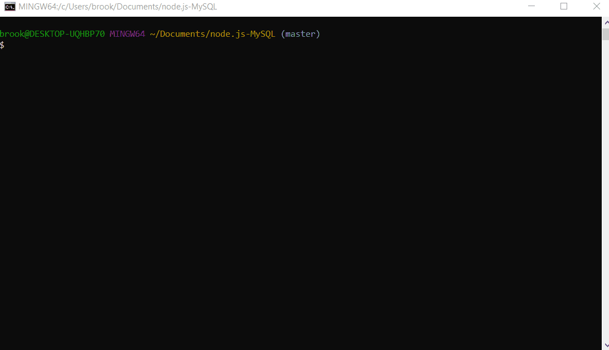

# node.js-MySQL

An Amazon-like storefront using MySQL and Node.  This app takes orders from customers and either tells them "Congratulations!" on the purchase, or let's them know there is not enough product.

